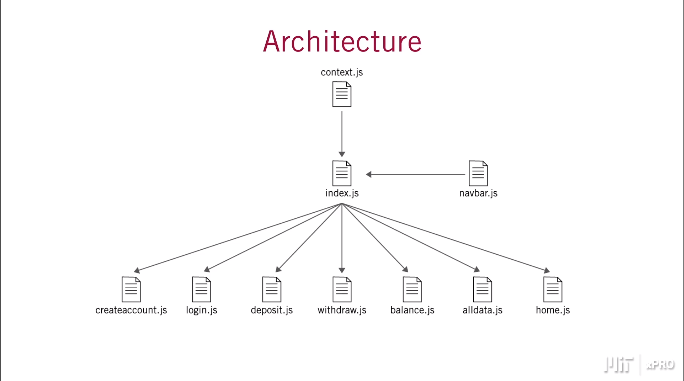
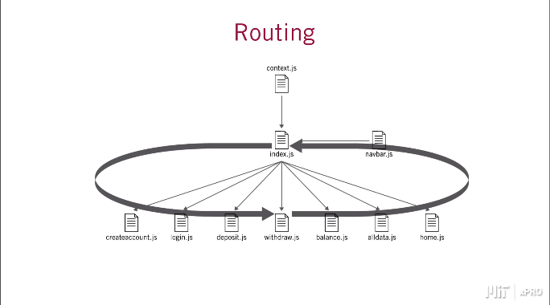

# MIT xPro Bad Bank React App

<h3>Architecture</h3>

<h3>Routing</h3>
 

## Description

Bad Bank is one of the Capstone Projects for MIT - Masters Fullstack Development course with MERN. This app presents a fictional bank without security (hence, Bad Bank) and incorporates concepts such as hooks, context, routing, and form validations.

## Features

* Create an account (as many as desired for this demo)
* Deposit money into last created account (last created for demo)
* Withdraw money into last created account (last created for demo)
* View all account data (minus balance as this was not a requirement)

Note: For simplicity, this app uses [React Context](https://reactjs.org/docs/context.html) to maintain account information.

## View Online

This app can be viewed online at:

[G.G.H Mziray MIT Bad Bank](https://gilleadgarymziraybankingapp.s3.amazonaws.com/index.html#/)

## Installation Guidelines

First, download this repo using `git clone `.

### Available Scripts

In the project directory, you can run:

#### `yarn or npm start`

Runs the app in development mode.
Open [http://localhost:3000](http://localhost:3000) to view it in the browser.

The page will reload if you make edits.
This is where you'll also see lint errors in the console.

#### `yarn or npm build`

Gets the app ready for production and create the `build` folder.
Bundling all you need for React in production mode and optimizes the build for the best performance.

The build is minified and the filenames include the hashes. 
Your app is ready to be deployed!

See the section about [deployment](https://facebook.github.io/create-react-app/docs/deployment) for more information.

## Technology

* React
* Bootstrap
* React Testing Library

## License

MIT
